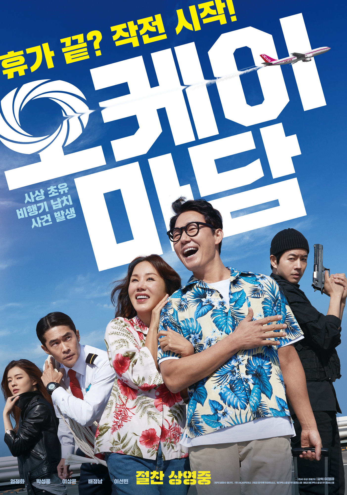

<!DOCTYPE html>
<html>
    <head>
        <meta charset="utf-8">
        <title> 나만의 장르별 영화추천PICK!!</title>
        
    </head>
    <body>
        <h1>장르별 영화추천PICK!!</h1>
        <ul>
            <li><a href="Romance.html"style="color: red">Romance</a></li>
            <li><a href="Action.html"style="color: blue">Action</a></li>
            <li><a href="Comedy.html"style="color: yellow">Comedy</a></li>
            <li><a href="SF(공상과학).html"style="color: green">Fantasy</a></li>
          </ul>
          
          
          
            
          
        
    </body>
</html>

<!DOCTYPE html>
<html>
    <head> <meta charset="utf-8">
        <title> 나만의 장르별 영화추천PICK!!</title>
        </head>
        
        <body>
            <h1>Action부문</h1>
            <h2>나만의 Action PICK!!</h2>

            
            <strong>"3000만큼 사랑해"</strong>
             인피니티 워 이후 절반만 살아남은 지구
            마지막 희망이 된 어벤져스 
             먼저 떠난 그들을 위해 모든 것을 걸었다! 
             위대한 어벤져스
            운명을 바꿀 최후의 전쟁이 펼쳐진다! 
            <strong>한줄평:</strong>
            <i>이 영화는 역대 마블 히어로들이 총집합하고 높은 퀄리티의 전쟁을 치루는 영화라 지루할 틈이 없는 영화이다.
            </i>

        </body>
    </html>
    
    <!DOCTYPE html>
<html>
    <head> <meta charset="utf-8">
        <title> 나만의 장르별 영화추천PICK!!</title>
        </head>
        
        <body>
            <h1>Comdey부문</h1>
            <h2>나만의 Comedy PICK!!</h2>

            
            <strong>"난 죽어도 비즈니스 클래스에서 죽을꺼야"</strong>
             극강의 쫄깃함으로 빠른 완판을 기록하는 
            꽈배기 맛집 사장 '미영'은 
             컴퓨터 수리 전문가 '석환'의 남다른 외조로 하와이 여행에 당첨되고, 
             난생처음 해외 여행을 떠나게 된다. 하지만 비밀 요원을 쫓는 테러리스트들도 
             같은 비행기에 오르고 꿈만 같았던 여행은 아수라장이 된다. 
             난데없는 비행기 납치 사건의 유일한 해결사가 되어버린 부부. 
             평범했던 과거는 접어두고, 숨겨왔던 내공을 펼치며 인질이 된 승객을 구하기 시작한다! 휴가 끝 ;;  
             작전 시작 ^^ 구하자 비행기! 가자 하와이로! 

            <strong>한줄평:</strong>
            <i>비행기 안에서 숨막히는 액션씬과 소소한 개그가 재미있는 영화이다.
            </i>

        </body>
</html>

<!DOCTYPE html>
<html>
    <head> <meta charset="utf-8">
        <title> 나만의 장르별 영화추천PICK!!</title>
        </head>
        
        <body>
            <h1>Romance부문</h1>
            <h2>나만의 Romance PICK!!</h2>

            
            <strong>"성장하는 동안 가장 잔인한 건 여학생은 남학생보다 성숙하며, 그 성숙함에 견뎌낼 남학생은 없다."</strong>
             학교 대표 얼간이 커징텅과 친구들은 최고의 모범생 션자이를 좋아한다. 수업 도중 사고를 친 커징텅은 
             션자이의 특별 감시를 받게 되고 둘은 점점 가까워진다. 션자이에 대한 마음이 커진 커징텅은 자신만의 방식으로 
             고백을 하지만 션자이는 대답하지 않는다. 그렇게 15년이 지나고, 
            두 사람은 다시 만나게 되는데… 
             그 때 너도 나와 같은 마음이었을까? 
            <strong>한줄평:</strong>
            <i>이 영화는 대만청춘영화로 학창시절에서부터 성인이 되기까지의 과정을 잘 담아둔 영화이며 훌륭한 OST에다가 현실적임과 동시에 감동적인 엔딩을 가지고 있어서 추천하는 영화이다.

            </i>

        </body>
</html>

<!DOCTYPE html>
<html>
    <head> <meta charset="utf-8">
        <title> 나만의 장르별 영화추천PICK!!</title>
        </head>
        
        <body>
            <h1>SF(공상과학)부문</h1>
            <h2>나만의 SF(공상과학) PICK!!</h2>

            
            <strong>"We will find a way, we always have"</strong>
             세계 각국의 정부와 경제가 완전히 붕괴된 미래가 다가온다. 
             지난 20세기에 범한 잘못이 전 세계적인 식량 부족을 불러왔고, NASA도 해체되었다. 
              이때 시공간에 불가사의한 틈이 열리고, 남은 자들에게는 이 곳을 탐험해 인류를 구해야 하는 임무가 지워진다. 
             사랑하는 가족들을 뒤로 한 채 인류라는 더 큰 가족을 위해, 그들은 이제 희망을 찾아 우주로 간다.
             
              그리고 우린 답을 찾을 것이다. 늘 그랬듯이…
              
            <strong>한줄평:</strong>
            <i>이 영화는 우주의 신비로운 배경을 사용하고 여러 이론등을 통하여 스토리를 진행하는 매우 시각적으로 흥분되는 영화이다.
            </i>

        </body>
    </html>

    
    
